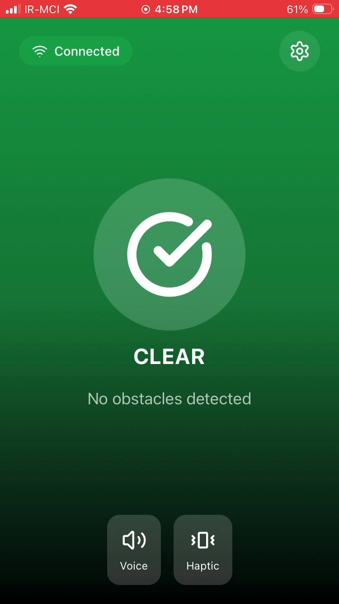
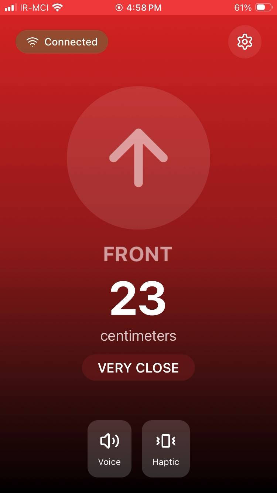
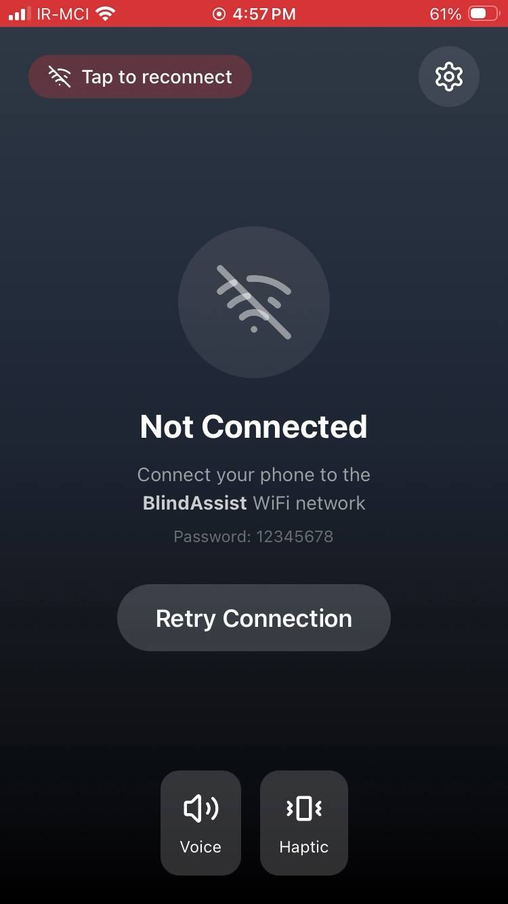
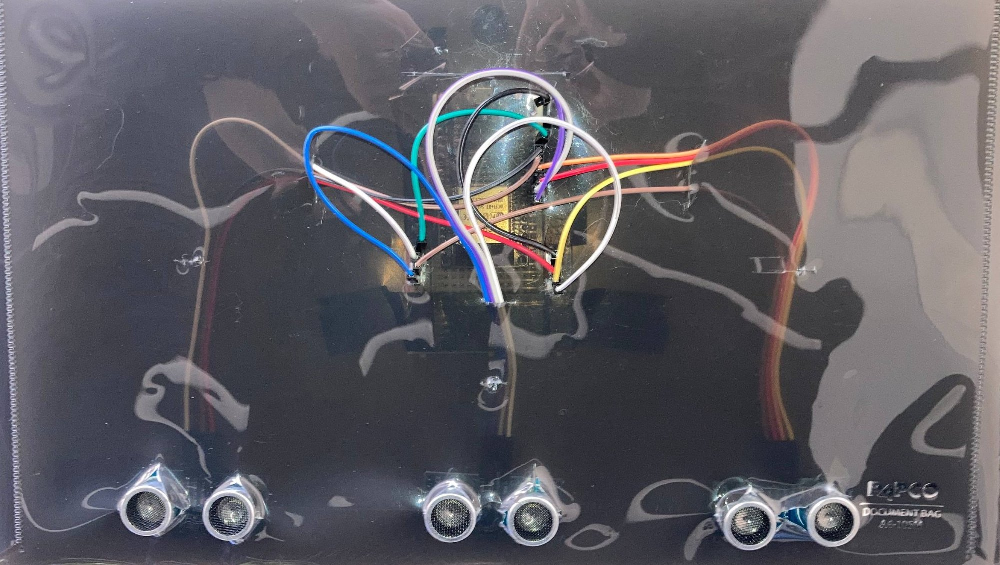
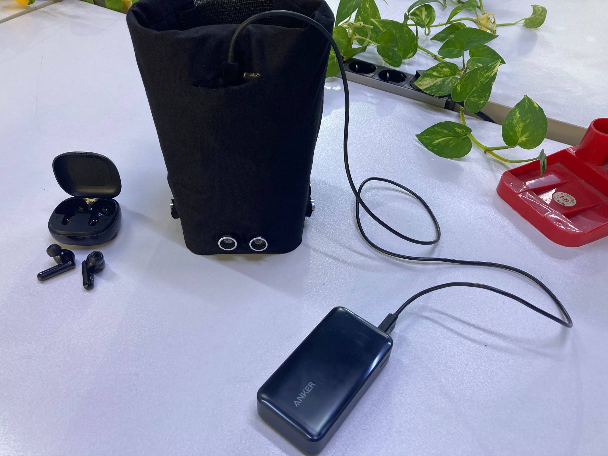
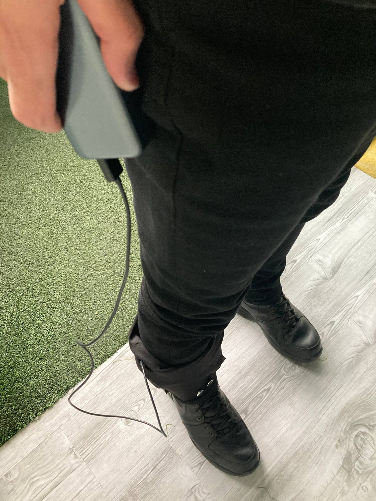

# 🦯 Path Pulse - Smart Blind Assistance System

[](https://www.arduino.cc/)
[](https://www.espressif.com/)
[](LICENSE)
[]()

> **ESP32-based wearable obstacle detection system with real-time voice feedback via smartphone**

An affordable, accessible navigation aid that uses ultrasonic sensors to detect obstacles in three directions and provides intuitive voice alerts through a mobile application.

---

## 🎬 Demo Video

> **📹 Watch the system in action!**

<div align="center">
  <a href="https://youtube.com/shorts/dQZRN9sjao8">
    
  </a>
  <p><em>👆 Click to watch on YouTube</em></p>
</div>

[](https://youtube.com/shorts/dQZRN9sjao8)

**What you'll see:**
- ✅ Real-time obstacle detection (front, right, back sensors)
- ✅ Distance measurement with voice feedback
- ✅ Color-coded app interface (green = clear, red = danger)
- ✅ Live system demonstration with actual obstacles

*Video shows the complete workflow from connection to obstacle avoidance*

---

## 📸 Project Showcase

### Mobile Application

<div align="center">
  
  
  
</div>

<p align="center"><em>Left: Clear path (green ✅) | Center: Front obstacle alert (red ⚠️) | Right: App "Path Pulse"</em></p>

**App Features:**
- 🗣️ **Voice Feedback** - Natural language obstacle alerts
- 📳 **Haptic Feedback** - Vibration option
- 📡 **Direct Wi-Fi** - Connects to ESP32 access point
- 🎨 **Color Coded** - Green (safe), Red (danger)
- 🔊 **Text-to-Speech** - Built-in smartphone TTS

---

### Hardware Build

<div align="center">
  
  
</div>

<p align="center"><em>Left: ESP32 with 3 ultrasonic sensors wired | Right: Packaged with power bank</em></p>

<div align="center">
  
  
</div>

<p align="center"><em>Left: Final mounted version | Right: User wearing the assistance system</em></p>

---

## 🎯 Key Features

- 🔍 **360° Awareness** - Front, Right, and Back obstacle detection
- 📡 **Wi-Fi Direct** - ESP32 Access Point (no router needed)
- 🗣️ **Voice Alerts** - "Obstacle front, very close, 23 centimeters"
- 📳 **Haptic Option** - Vibration feedback support
- 🔋 **8-10hr Battery** - Portable power bank powered
- ♿ **Accessibility First** - Designed for visually impaired users
- 📱 **No Internet** - Works completely offline

---

## 🏗️ Hardware Components

| Component | Qty | Purpose | Cost |
|-----------|-----|---------|------|
| **ESP32 Dev Board** | 1 | Main controller + Wi-Fi |
| **HC-SR04 Ultrasonic Sensors** | 3 | Distance measurement (Front/Right/Back) |
| **Power Bank** | 1 | Portable power bank |
| **Jumper Wires** | 1 set | Connections |
| **Packaging/Straps** | - | Wearable mounting |


### Sensor Specifications

**HC-SR04 Ultrasonic:**
- Range: 2cm - 400cm
- Accuracy: ±3mm
- Beam angle: 15°
- Trigger: 10µs pulse
- Operating: 5V

---

## 📐 System Architecture

```
┌─────────────────────┐
│      USER           │
│   (Wears Device)    │
└──────────┬──────────┘
           │
    ┌──────┴──────┐
    │             │
    ▼             ▼
┌────────┐   ┌─────────┐
│ ESP32  │◄─►│ Phone   │
│ Device │WiFi│ App     │
└───┬────┘   └─────────┘
    │
    │ GPIO Pins
    ▼
┌────────────────┐
│ 3× HC-SR04     │
│ - Front Sensor │
│ - Right Sensor │
│ - Back Sensor  │
└────────────────┘
```

---

## 📊 Pin Configuration

### ESP32 GPIO Mapping

| Sensor | Trigger Pin | Echo Pin | Coverage |
|--------|------------|----------|----------|
| **Front** | GPIO 27 | GPIO 26 | Forward obstacles |
| **Right** | GPIO 33 | GPIO 32 | Side obstacles |
| **Back** | GPIO 12 | GPIO 14 | Rear obstacles |

### Distance Alert Thresholds

| Range | Distance | Alert Level | Color | Voice |
|-------|----------|-------------|-------|-------|
| **Danger** | < 50cm | Very Close | 🔴 Red | "Very close" |
| **Warning** | 50-100cm | Close | 🟠 Orange | "Close" |
| **Caution** | 100-200cm | Approaching | 🟡 Yellow | "Approaching" |
| **Safe** | > 200cm | Clear | 🟢 Green | "Path clear" |

---

## 🚀 Quick Start Guide

### Prerequisites

**Hardware:**
- ESP32 development board
- 3× HC-SR04 ultrasonic sensors
- Power bank or USB power
- Smartphone (iOS/Android)

**Software:**
- Arduino IDE 2.0+ ([Download](https://www.arduino.cc/en/software))
- ESP32 board support

---

### Step 1: Arduino IDE Setup

1. **Install Arduino IDE**
   - Download: https://www.arduino.cc/en/software

2. **Add ESP32 Board**
   - `File` → `Preferences`
   - Additional Board Manager URLs:
     ```
     https://raw.githubusercontent.com/espressif/arduino-esp32/gh-pages/package_esp32_index.json
     ```
   - `Tools` → `Board` → `Boards Manager`
   - Search "ESP32" and install

3. **Select Board**
   - `Tools` → `Board` → `ESP32 Dev Module`

---

### Step 2: Hardware Wiring

**Connection Diagram:**

```
ESP32              HC-SR04 (Front)
GPIO 27 ────────► TRIG
GPIO 26 ◄──────── ECHO
5V ──────────────► VCC
GND ─────────────► GND

(Repeat for Right: GPIO 33/32, Back: GPIO 12/14)
```

**Assembly Steps:**

1. Connect all 3 sensors to ESP32
2. Wire VCC to 5V, GND to GND
3. Connect trigger and echo pins as shown above
4. Connect ESP32 to power bank via USB
5. Mount sensors facing front, right, and back

⚠️ **Important:** HC-SR04 operates at 5V, but ESP32 GPIO is 3.3V. The sensors usually work fine, but for best results consider using voltage dividers on echo pins.

---

### Step 3: Upload Code

1. **Open Code**
   - Open `src/blind_assist.ino` in Arduino IDE

2. **Configure (Optional)**
   ```cpp
   // Wi-Fi credentials
   const char* ssid = "BlindAssist";
   const char* password = "12345678";
   
   // Distance thresholds (cm)
   #define DANGER_CM   50
   #define WARNING_CM  100
   #define INFO_CM     200
   ```

3. **Upload**
   - Connect ESP32 via USB
   - Select port: `Tools` → `Port`
   - Click Upload (→)

4. **Verify**
   - Open Serial Monitor (115200 baud)
   - Should see:
     ```
     Wi-Fi name: BlindAssist
     IP address: 192.168.4.1
     HTTP server started
     ```

---

### Step 4: Mobile App

**AI App Builder**

We used an AI-powered no-code app builder:
- Platform: Vibe Code
- HTTP GET to: `http://192.168.4.1/alert`
- Text-to-Speech component for voice
- Update interval: 2 seconds

---

## 📱 Usage Instructions

### Connection

1. **Power On Device**
   - Connect ESP32 to power bank
   - Wait 5 seconds for boot

2. **Connect Phone**
   - Settings → Wi-Fi
   - Network: **BlindAssist**
   - Password: **12345678**

3. **Open App**
   - Launch app

4. **Navigate**
   - System announces obstacles every 2 seconds
   - Listen for voice feedback

---

### Voice Alert Examples

| Alert | Meaning |
|-------|---------|
| "Path clear" | No obstacles within 2 meters |
| "Obstacle front, very close, 23 centimeters" | Front sensor: 23cm |
| "Obstacle right, close, 87 centimeters" | Right sensor: 87cm |
| "Obstacle back, approaching, 156 centimeters" | Back sensor: 156cm |

**Priority System:**
- Reports **closest** obstacle first
- Specifies **direction** (front/right/back)
- States **distance** in centimeters
- Indicates **urgency** level

---

## 🔧 Configuration

### Adjust Detection Range

Edit `blind_assist.ino`:

```cpp
#define DANGER_CM   50    // Very close alert
#define WARNING_CM  100   // Close alert
#define INFO_CM     200   // Approaching alert
```

### Change Wi-Fi Settings

```cpp
const char* ssid = "YourName";
const char* password = "YourPassword";  // Min 8 chars
```

### Sensor Tuning

```cpp
#define SAMPLES        5   // Median filter samples (3-7)
#define SENSOR_DELAY   60  // ms between sensors (prevent crosstalk)
```

---

## 📊 Performance Metrics

| Metric | Value |
|--------|-------|
| **Detection Range** | 2-400 cm |
| **Update Rate** | ~2Hz (every 2 seconds) |
| **Wi-Fi Range** | 10-15 meters indoors |
| **Power Draw** | ~250mA @ 5V |
| **Battery Life** | 8-10 hours (2500mAh) |
| **Response Time** | < 500ms |
| **Accuracy** | ±3cm |
| **Weight** | ~200g (with packaging) |

---

## 🐛 Troubleshooting

### Can't Find Wi-Fi Network

**Problem:** "BlindAssist" network not visible

**Solutions:**
1. Check ESP32 power LED is on
2. Open Serial Monitor - verify "Access Point" message
3. Restart ESP32
4. Try disabling/enabling phone Wi-Fi

---

### Sensors Not Working

**Problem:** Always shows "Path clear" or 999cm

**Solutions:**
1. **Check wiring:**
   - Verify all connections are firm
   - Confirm 5V to sensor VCC
   - Check GPIO pins match code

2. **Test individually:**
   ```cpp
   void loop() {
     int d = getDistanceFiltered(TRIG_FRONT, ECHO_FRONT);
     Serial.println(d);
     delay(500);
   }
   ```

3. **Power issue:**
   - Some sensors need 5V consistently
   - Try powered USB hub if using USB

---

### Erratic Readings

**Problem:** Distance jumps randomly

**Solutions:**
1. Increase sensor delay:
   ```cpp
   #define SENSOR_DELAY 100  // Increase from 60ms
   ```

2. More filtering:
   ```cpp
   #define SAMPLES 7  // Increase from 5
   ```

3. Check mounting:
   - Sensors should face clearly forward
   - Avoid soft/angled surfaces
   - Space sensors apart

---

### App Won't Connect

**Problem:** Can't reach ESP32

**Solutions:**
1. Verify connected to "BlindAssist" Wi-Fi
2. Try browser: `http://192.168.4.1/alert`
3. Check phone firewall allows local connections
4. Restart both ESP32 and phone

---

## 📈 Future Improvements

### Hardware Enhancements

- [ ] **LiDAR Sensors** - Better accuracy than ultrasonic
- [ ] **ESP32-CAM** - Camera-based object recognition
- [ ] **IMU Sensor** - Fall detection capability
- [ ] **Custom PCB** - Professional board design
- [ ] **Waterproof Case** - Weather protection
- [ ] **Rechargeable Battery** - Built-in charging

### Software Features

- [ ] **Machine Learning** - Object classification
- [ ] **GPS Integration** - Outdoor navigation
- [ ] **Path Memory** - Remember common routes
- [ ] **Multi-Language** - Voice in different languages
- [ ] **Cloud Sync** - Usage statistics
- [ ] **Obstacle Database** - Crowd-sourced hazards

### User Experience

- [ ] **Customizable Voice** - Speed, pitch, language
- [ ] **Haptic Patterns** - Different vibrations for directions
- [ ] **Training Mode** - Learn to use the system
- [ ] **Companion App** - For caregivers

---

## 🤝 Contributing

Contributions welcome! Here's how:

**Areas for Improvement:**
- Hardware design (PCB layout, 3D enclosure)
- Software features (ML, GPS, mapping)
- Mobile apps (native iOS/Android)
- Documentation (videos, tutorials)
- Testing (accessibility, usability)

**To Contribute:**
1. Fork repository
2. Create branch (`git checkout -b feature/CameraIntegration`)
3. Commit changes (`git commit -m 'Add ESP32-CAM support'`)
4. Push branch (`git push origin feature/CameraIntegration`)
5. Open Pull Request

---

## 📖 Project Documentation

**📄 Full Academic Report:** [Blind_Assistance_System_Project_Report.pdf](docs/Blind_Assistance_System_Project_Report.pdf)

**Contents:**
- Abstract & Introduction
- Related Work & Literature Review
- System Design & Architecture
- Hardware & Software Implementation
- Mobile Application Development
- Experimental Results & Analysis
- Limitations & Future Work
- Conclusion & References

**Course:** Robotics Rehabilitation  
**Institution:** University of Tehran
**Semester:** Winter 2026

## 👤 Author

**AmirHossein Osooli**
- Robotics Rehabilitation Final Project
---

### Related Projects
- [Smart Cane Projects](https://github.com/topics/smart-cane)
- [Assistive Technology](https://github.com/topics/assistive-technology)
- [Ultrasonic Sensors](https://github.com/topics/ultrasonic-sensor)

---

## 📄 License

MIT License - Free to use, modify, and distribute

```
MIT License

Copyright (c) 2026 Path Pulse Project

Permission is hereby granted, free of charge, to any person obtaining a copy
of this software and associated documentation files (the "Software"), to deal
in the Software without restriction, including without limitation the rights
to use, copy, modify, merge, publish, distribute, sublicense, and/or sell
copies of the Software, and to permit persons to whom the Software is
furnished to do so, subject to the following conditions:

The above copyright notice and this permission notice shall be included in all
copies or substantial portions of the Software.
```

---

## 🙏 Acknowledgments

- **Course:** Robotics Rehabilitation
- **Instructor:** Amir Hossein Osooli
- **Institution:** University of Tehran
- **Open Source Community** for tools and libraries
- **Visually Impaired Community** for feedback and testing

---

## 📞 Support & Contact

- 📧 **Email:** amirh.osooli@gmail.com
- 🐛 **Issues:** [GitHub Issues](https://github.com/yourusername/blind-assistance-system/issues)
- 💬 **Discussions:** [GitHub Discussions](https://github.com/yourusername/blind-assistance-system/discussions)
- 📖 **Documentation:** See [docs/](docs/) folder

---

## 🌟 Project Stats

| Metric | Value |
|--------|-------|
| **Build Cost** | ~$25 USD |
| **Build Time** | 4-6 hours |
| **Difficulty** | ⭐⭐⭐ Intermediate |
| **Impact** | ♿ High (Accessibility) |
| **Code Size** | ~180 lines Arduino C |
| **Components** | 5 main parts |

---

<div align="center">

## 🦯 Making Navigation Accessible for All

[](https://www.espressif.com/)
[](LICENSE)
[]()

**[Demo Video](#demo-video)** • **[Hardware](#hardware-components)** • **[Quick Start](#quick-start-guide)** • **[Report](docs/Blind_Assistance_System_Project_Report.pdf)**

**Version 1.0** | **February 2026** | **MIT License**

⭐ **Star this repository to support accessible technology!**

---

### Quick Links

🎬 [Demo](# demo-video) | 🔧 [Hardware](#hardware-components) | 💻 [Code](src/) | 🐛 [Issues](https://github.com/yourusername/blind-assistance-system/issues)

---

*"Technology should empower everyone, regardless of ability"*

**Making the world more accessible, one step at a time.** 🌍♿

</div>
